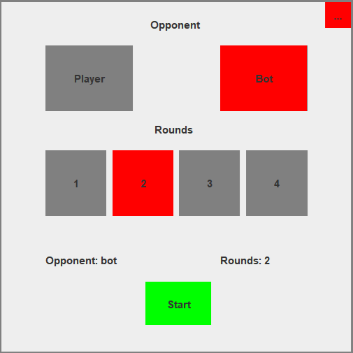

<p align="center">
  
</p>

<h3 align="center">
  Tic-tac-toe is a simple game that you can play with your friend or even with a bot.
</h3>

## ✅ Features
- 🎮 PvP and PvE mode 
- 🧠 Bot with random moves 
- 🔄 Multiple rounds  
- 🎨 User-friendly interface with Java Swing

<p align="left">
  
The interface of the project was made with Java Swing, it's looks old but works well, here is a sample:

|       |       |       |
|-------|-------|-------|
|  |  |  |

</p>


<br/>

## 🛠️ Technologies
- Java 21
- Swing

<br/>

## 🚀 How to run
At first, to test the project you'll need to have [JDK 21+](https://www.oracle.com/java/technologies/downloads/) and [Git](https://git-scm.com/downloads), if you alright have it, so you can clone my repository:

```bash
git clone https://github.com/devgabrieljeronimo/Tic-Tac-Toe.git
```

<br/>

## 🌐 Feedback
Please, feel free to do a [issue](https://github.com/devgabrieljeronimo/Tic-Tac-Toe/issues/new) or give me a feedback on my [email](gabrieljeronimo2b.007@gmail.com), your feedback is helping me to be a better programmer!

<br/>

## 👥 Owner
- Gabriel Jeronimo — [@devgabrieljeronimo](https://github.com/devgabrieljeronimo)

